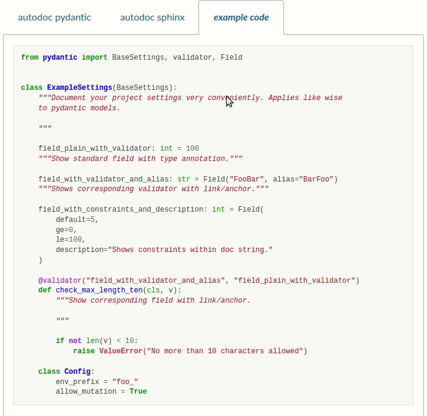

You love [pydantic](https://pydantic-docs.helpmanual.io/) :heart: and you want to document your models and configuration settings with [sphinx](https://www.sphinx-doc.org/en/master/)? 

Perfect, let's go. But wait, sphinx' [autodoc](https://www.sphinx-doc.org/en/master/usage/extensions/autodoc.html) does not integrate too well with pydantic models :confused:. 

Don't worry - just `pip install autodoc_pydantic` :relaxed:.

## Features

- :speech_balloon: provides default values, alias and constraints for model fields
- :link: adds references between validators and corresponding fields
- :page_with_curl: includes collapsable model json schema
- :surfer: natively integrates with autodoc extension
- :paperclip: defines explicit pydantic prefixes for models, settings, fields, validators and model config
- :clipboard: shows summary section for model configuration and validators
- :eyes: hides overloaded and redundant model class signature
- :books: sorts fields, validators and model config within models by type
- 🍀 Supports `pydantic >= 1.5.0` and `sphinx >= 3.4.0`

### Comparison between autodoc sphinx and autodoc pydantic

To see those features in action, jump over to the [example documentation](https://autodoc-pydantic.readthedocs.io/en/latest/examples.html#default-configuration) to compare
the appearance of standard sphinx autodoc with *autodoc_pydantic*.

## Documentation

For more details, please visit the official [documentation](https://autodoc-pydantic.readthedocs.io/en/latest/):

- [Installation](https://autodoc-pydantic.readthedocs.io/en/latest/installation.html)
- [Configuration](https://autodoc-pydantic.readthedocs.io/en/latest/configuration.html)
- [Usage](https://autodoc-pydantic.readthedocs.io/en/latest/usage.html)
- [Examples](https://autodoc-pydantic.readthedocs.io/en/latest/examples.html)

## Acknowledgements

Thanks to great open source projects [sphinx](https://www.sphinx-doc.org/en/master/), [pydantic](https://pydantic-docs.helpmanual.io/) and [poetry](https://python-poetry.org/) (and so many more) :heart: !
